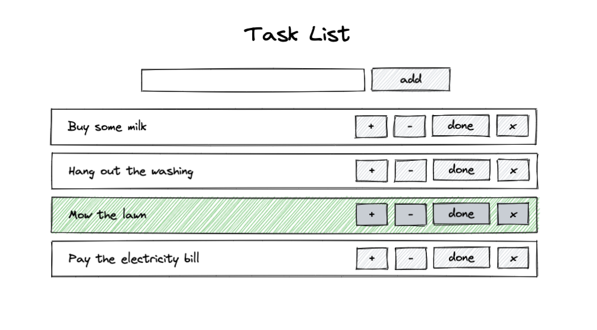

# Scenario

Build a task list per the UI design that will perform the following operations:

* Interact with API to
  * List all items
  * Add tasks with name
  * Mark tasks as "done". Tasks that are "done" should be highlighted.
  * Remove tasks
* UI should update when any tasks that alter the list occur

## UI


## API
`GET /list` Lists all tasks.
`Response:`
```json
[
  {
    "name": "Buy some milk",
    "status": false
  },
  {
    "name": "Hang out the washing",
    "status": false
  },
  {
    "name": "Mow the lawn",
    "status": true
  },
  {
    "name": "Pay the electricity bill",
    "status": false
  }
]
```

`POST /add` Adds a task to the list. Tasks are given a `status: false` automatically.
`Request:`
```json
{
  "name": "Buy some milk"
}
```

`POST /add` Appends a task to the list
`Request:`
```json
{
  "name": "Buy some milk"
}
```

`DELETE /remove` Removes task at the specified index
`Request:`
```json
{
  "index": 1
}
```

`POST /update` Updates/replaces a task at the specific index
`Request:`
```json
{
  "index": 1,
  "name": "Buy some milk",
  "status": false
}
```

`POST /insert` Adds a task at the specified index
`Request:`
```json
{
  "name": "Buy some milk",
  "status": false
}
```

## Reference
* Using Fetch API - https://developer.mozilla.org/en-US/docs/Web/API/Fetch_API/Using_Fetch
* Using Axios - https://github.com/axios/axios#example