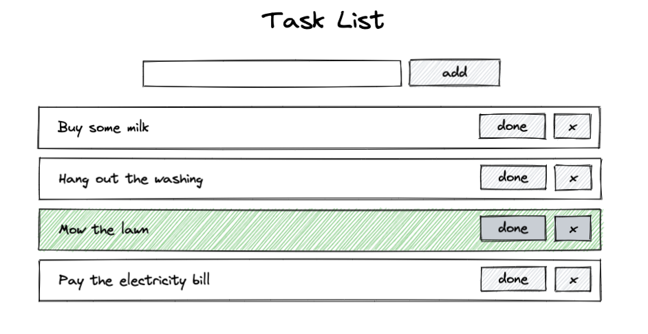

# Scenario

Build a task list that will perform the following operations:

* Load and save items to an API. Data should persist refreshing.
* Add tasks with name
* Remove tasks
* Mark tasks as "done". Tasks that are "done" should be highlighted.
* Reorder tasks

## UI


## API
`GET /list`
Lists all tasks.
```json
[
  {
    "name": "Buy some milk",
    "status": false
  },
  {
    "name": "Hang out the washing",
    "status": false
  },
  {
    "name": "Mow the lawn",
    "status": true
  },
  {
    "name": "Pay the electricity bill",
    "status": false
  }
]
```

`POST /add`
Adds a task to the list. Tasks are given a `status: false` automatically.
```json
// request payload
{
  name: "Buy some milk"
}
```

`POST /add`
Appends a task to the list
```json
// request payload
{
  name: "Buy some milk"
}
```

`DELETE /remove`
Removes task at the specified index
```json
// request payload
{
  index: 1
}
```

`POST /insert`
Adds a task at the specified index
```json
// request payload
{
  name: "Buy some milk",
  status: false
}
```

## Reference
* Using Fetch API - https://developer.mozilla.org/en-US/docs/Web/API/Fetch_API/Using_Fetch